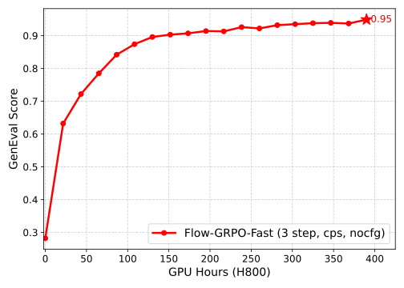
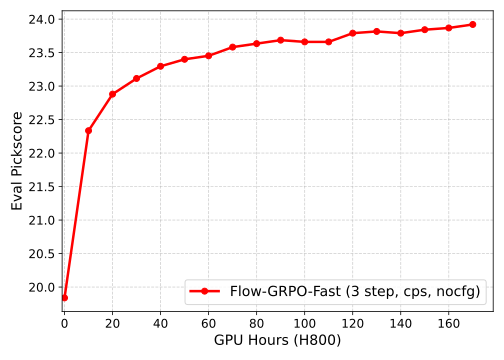
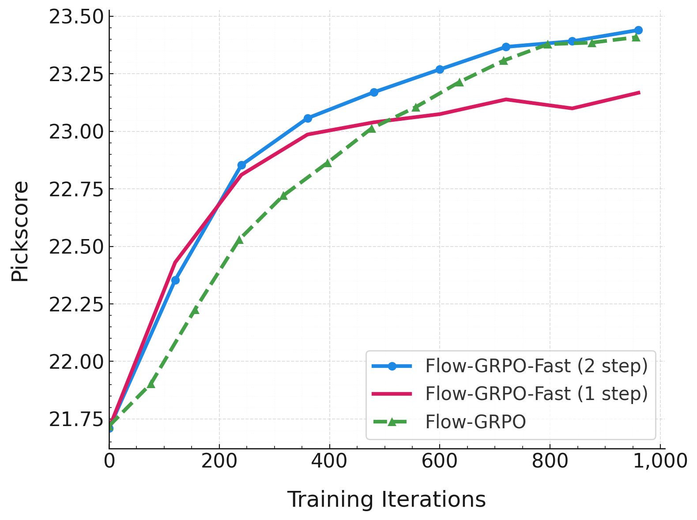
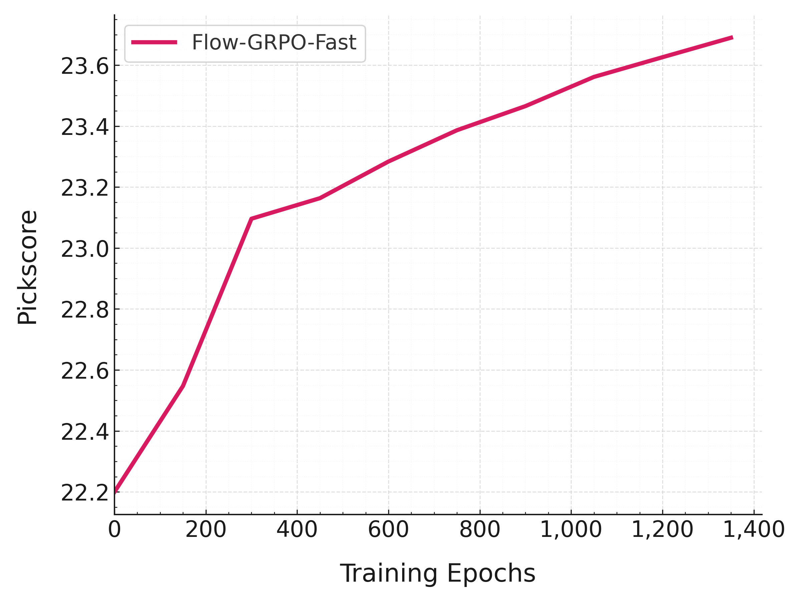
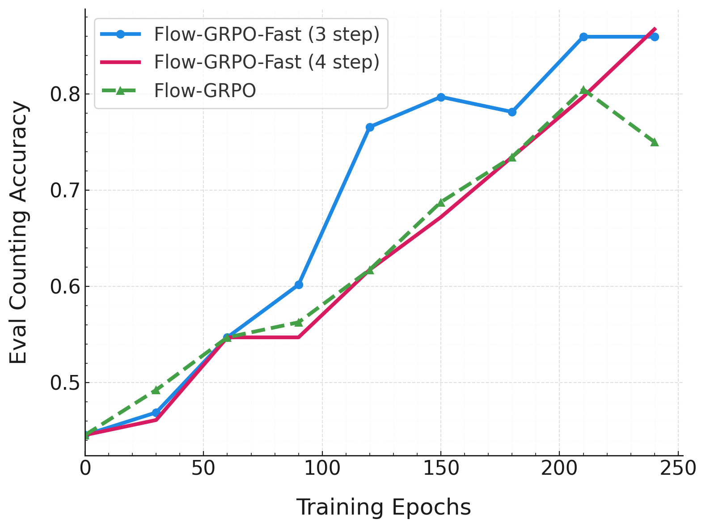
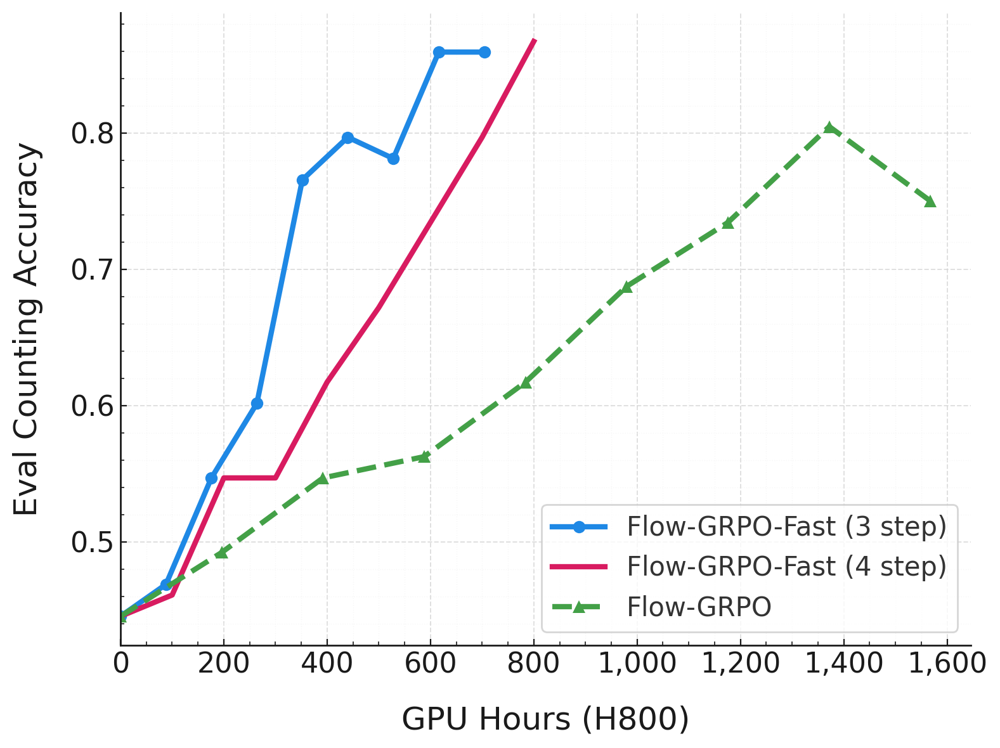

<h1 align="center"> Flow-GRPO:<br>Training Flow Matching Models via Online RL </h1>
<div align="center">
  <a href='https://arxiv.org/abs/2505.05470'></a>  &nbsp;
  <a href='https://gongyeliu.github.io/Flow-GRPO/'></a> &nbsp;
  <a href="https://github.com/yifan123/flow_grpo"></a> &nbsp; 
  <a href='https://huggingface.co/collections/jieliu/sd35m-flowgrpo-68298ec27a27af64b0654120'></a> &nbsp; 
  <a href='https://huggingface.co/spaces/jieliu/SD3.5-M-Flow-GRPO'></a> &nbsp;
</div>

## Changelog
<details open>
<summary><strong>2025-10-14</strong></summary>

* Refactor FlowGRPO-Fast for compatibility with FlowGRPO, add CPS sampling and No-CFG training on SD3.

</details>

<details>
<summary><strong>Update History</strong></summary>

**2025-08-15**

* Adding support for **Qwen-Image** and **Qwen-Image-Edit**.

**2025-08-15**

* Thanks [Jing Wang](https://scholar.google.com.hk/citations?user=Q9Np_KQAAAAJ&hl=zh-CN) for adding **Wan2.1**. Training command
```bash
accelerate launch --config_file scripts/accelerate_configs/multi_gpu.yaml --num_processes=1 --main_process_port 29503 scripts/train_wan2_1.py --config config/grpo.py:general_ocr_wan2_1
```

**2025-08-14**

* Adding reward curve of Flow-GRPO-Fast vs. Flow-GRPO. In Pickscore reward, Flow-GRPO-Fast is comparable to Flow-GRPO with only 2 steps training.


**2025-08-04**

* Adding support for **FLUX.1-Kontext-dev**. For the counting task, we use Geneval reward to detect object counts and CLIP feature similarity to ensure consistency between the original and edited images. This implementation offers a runnable pipeline, but the training set contains only 800 samples. Making Flow-GRPO truly effective for editing tasks still requires further exploration by the community.


**2025-07-31**

- Adding Flow-GRPO-Fast.

**2025-07-28**

- Adding support for **FLUX.1-dev**.
- Adding support for CLIPScore as reward model.
- Introducing `config.sample.same_latent` to control whether the same noise is reused for identical prompts, addressing [Issue #7](https://github.com/yifan123/flow_grpo/issues/7).

**2025-05-15** 

- 🔥We showcase image examples from three tasks and their training evolution at https://gongyeliu.github.io/Flow-GRPO. Check them out!
- 🔥We now provide an online demo for all three tasks at https://huggingface.co/spaces/jieliu/SD3.5-M-Flow-GRPO. You're welcome to try it out!
</details>

## 🤗 Model
| Task    | Model |
| -------- | -------- |
| GenEval     | [🤗GenEval](https://huggingface.co/jieliu/SD3.5M-FlowGRPO-GenEval) |
| Text Rendering     | [🤗Text](https://huggingface.co/jieliu/SD3.5M-FlowGRPO-Text) |
| Human Preference Alignment     | [🤗PickScore](https://huggingface.co/jieliu/SD3.5M-FlowGRPO-PickScore) |


## Training Speed

To improve training efficiency, we provide a better set of parameters for Flow-GRPO.
We found the following adjustments significantly accelerate training:

* No CFG during training or testing — the RL process effectively performs **CFG distillation**.
* Use the window mechanism from **Flow-GRPO-Fast** or **[MixGRPO](https://www.arxiv.org/abs/2507.21802)** — only train on partial steps.
* Adopt **[Coefficients-Preserving Sampling](https://arxiv.org/abs/2509.05952) (CPS)** — CPS provides a notable improvement on GenEval, and produces higher-quality samples. A typical setting is `noise_level = 0.8`, which works well without tuning for different models or step counts.

The figure below shows the test-set performance curves using GenEval and PickScore as rewards, where both training and evaluation are performed **without CFG**. The experiments are configured with [**geneval_sd3_fast_nocfg**](https://github.com/yifan123/flow_grpo/blob/main/config/grpo.py#L163) and [**pickscore_sd3_fast_nocfg**](https://github.com/yifan123/flow_grpo/blob/main/config/grpo.py#L323), using scripts from `scripts/multi_node/sd3_fast`.

<p align="center">
  
   
</p>


## Flow-GRPO-Fast
We propose Flow-GRPO-Fast, an accelerated variant of Flow-GRPO that requires training on **only one or two denoising step** per trajectory. For each prompt, we first generate a deterministic trajectory using ODE sampling. At a randomly chosen intermediate step, we inject noise and switch to SDE sampling to generate a group. The rest of the process continues with ODE sampling. This confines stochasticity to one or two steps, allowing training to focus solely on that steps. This few-step training idea was primarily proposed by [Ziyang Yuan](https://scholar.google.com/citations?user=fWxWEzsAAAAJ&hl=en) during our discussions in early June. 

Flow-GRPO-Fast achieves significant efficiency gains:

- Each trajectory is trained only once or twice, significantly reducing the training cost.

- Sampling before branching requires only a single prompt without group expansion, further speeding up data collection.

Experiments on PickScore show that Flow-GRPO-Fast matches the reward performance of Flow-GRPO while offering faster training speed. The x-axis in the figure represents training epochs. Flow-GRPO-Fast with 2 training steps per iteration performs better than Flow-GRPO, while Flow-GRPO-Fast with only 1 training step per iteration performs slightly worse than Flow-GRPO. In both cases, compared to Flow-GRPO’s 10 training steps per iteration, the training process is significantly faster.

<p align="center">
  
</p>


Please use scripts in `scripts/multi_node/sd3_fast` to run these experiments.


## 🚀 Quick Started
### 1. Environment Set Up
Clone this repository and install packages.
```bash
git clone https://github.com/yifan123/flow_grpo.git
cd flow_grpo
conda create -n flow_grpo python=3.10.16
pip install -e .
```

### 2. Model Download
To avoid redundant downloads and potential storage waste during multi-GPU training, please pre-download the required models in advance.

**Models**
* **SD3.5**: `stabilityai/stable-diffusion-3.5-medium`
* **Flux**: `black-forest-labs/FLUX.1-dev`

**Reward Models**
* **PickScore**:
  * `laion/CLIP-ViT-H-14-laion2B-s32B-b79K`
  * `yuvalkirstain/PickScore_v1`
* **CLIPScore**: `openai/clip-vit-large-patch14`
* **Aesthetic Score**: `openai/clip-vit-large-patch14`


### 3. Reward Preparation
The steps above only install the current repository. Since each reward model may rely on different versions, combining them in one Conda environment can cause version conflicts. To avoid this, we adopt a remote server setup inspired by ddpo-pytorch. You only need to install the specific reward model you plan to use.

#### GenEval
Please create a new Conda virtual environment and install the corresponding dependencies according to the instructions in [reward-server](https://github.com/yifan123/reward-server).

#### OCR
Please install paddle-ocr:
```bash
pip install paddlepaddle-gpu==2.6.2
pip install paddleocr==2.9.1
pip install python-Levenshtein
```
Then, pre-download the model using the Python command line:
```python
from paddleocr import PaddleOCR
ocr = PaddleOCR(use_angle_cls=False, lang="en", use_gpu=False, show_log=False)
```

#### Pickscore
PickScore requires no additional installation. Note that the original [pickscore](https://huggingface.co/datasets/yuvalkirstain/pickapic_v1) dataset corresponds to `dataset/pickscore` in this repository, containing some NSFW prompts. We strongly recommend using [pickapic\_v1\_no\_images\_training\_sfw](https://huggingface.co/datasets/CarperAI/pickapic_v1_no_images_training_sfw), the SFW version of the Pick-a-Pic dataset, which corresponds to `dataset/pickscore_sfw` in this repository.

#### DeQA
Please create a new Conda virtual environment and install the corresponding dependencies according to the instructions in [reward-server](https://github.com/yifan123/reward-server).

#### UnifiedReward
Since `sglang` may conflict with other environments, we recommend creating a new conda environment.
```bash
conda create -n sglang python=3.10.16
conda activate sglang
pip install "sglang[all]"
```
We use sglang to deploy the reward service. After installing sglang, please run the following command to launch UnifiedReward:
```bash
python -m sglang.launch_server --model-path CodeGoat24/UnifiedReward-7b-v1.5 --api-key flowgrpo --port 17140 --chat-template chatml-llava --enable-p2p-check --mem-fraction-static 0.85
```
#### ImageReward
Please install imagereward:
```bash
pip install image-reward
pip install git+https://github.com/openai/CLIP.git
```

### 4. Start Training

#### GRPO

- Single-node training:
```bash
# sd3
bash scripts/single_node/grpo.sh
# flux
bash scripts/single_node/grpo_flux.sh
```
- Multi-node training for SD3:
```bash
# Master node
bash scripts/multi_node/sd3.sh 0
# Other nodes
bash scripts/multi_node/sd3.sh 1
bash scripts/multi_node/sd3.sh 2
bash scripts/multi_node/sd3.sh 3
```
- Multi-node training for FLUX.1-dev:
```bash
# Master node
bash scripts/multi_node/flux.sh 0
# Other node
bash scripts/multi_node/flux.sh 1
bash scripts/multi_node/flux.sh 2
bash scripts/multi_node/flux.sh 3
```
For Flow-GRPO-Fast, please use `scripts/multi_node/flux_fast.sh`. See the W&B logs for [Geneval](https://api.wandb.ai/links/ljie/qz47q208) (with `geneval_flux_fast` in the config) and [PickScore](https://api.wandb.ai/links/ljie/ncdwa0wo) (with `pickscore_flux_fast` in the config).


- Multi-node training for FLUX.1-Kontext-dev:

Please first download [generated\_images.zip](https://huggingface.co/datasets/jieliu/counting_edit/blob/main/generated_images.zip) and extract it into the `counting_edit` directory. You can also use the scripts in the `counting_edit` directory to generate the data yourself.

Please install `diffusers` from the main branch to support `FLUX.1-Kontext-dev`:
```bash
pip install git+https://github.com/huggingface/diffusers.git
```
After upgrading Diffusers, some packages such as PEFT may also need to be upgraded. If you encounter any errors, please upgrade them according to the error messages.
Then, run the scripts:
```bash
# Master node
bash scripts/multi_node/flux_kontext.sh 0
# Other nodes
bash scripts/multi_node/flux_kontext.sh 1
bash scripts/multi_node/flux_kontext.sh 2
bash scripts/multi_node/flux_kontext.sh 3
```


- Multi-node training for Qwen-Image:

In the implementation of Qwen-Image, we have unified Flow-GRPO and Flow-GRPO-Fast. You can control the size of the SDE window with `config.sample.sde_window_size`, and adjust the position of the window with `config.sample.sde_window_range`.

Please install `diffusers` from the main branch to support `Qwen-Image`:
```bash
pip install git+https://github.com/huggingface/diffusers.git
```
Then run the scripts:
```bash
# Master node
bash scripts/multi_node/qwenimage.sh 0
# Other nodes
bash scripts/multi_node/qwenimage.sh 1
bash scripts/multi_node/qwenimage.sh 2
bash scripts/multi_node/qwenimage.sh 3
```
Using the provided configuration, the resulting reward curve of Qwen-Image on the test set is shown below.

<p align="center">
  
</p>


- Multi-node training for Qwen-Image-Edit:

Same as Flux Kontext, please first download [generated\_images.zip](https://huggingface.co/datasets/jieliu/counting_edit/blob/main/generated_images.zip) and extract it into the `counting_edit` directory. You can also use the scripts in the `counting_edit` directory to generate the data yourself.

Please install `diffusers` from the main branch to support `Qwen-Image-Edit`:
```bash
pip install git+https://github.com/huggingface/diffusers.git
```
Then run the scripts:
```bash
# Master node
bash scripts/multi_node/qwenimage_edit.sh 0
# Other nodes
bash scripts/multi_node/qwenimage_edit.sh 1
bash scripts/multi_node/qwenimage_edit.sh 2
bash scripts/multi_node/qwenimage_edit.sh 3
```

Using the provided configuration, the resulting reward curve of Qwen-Image-Edit on the test set is shown below.

<p align="center">
  
   
</p>


#### DPO / OnlineDPO / SFT / OnlineSFT
 Single-node training:
```bash
bash scripts/single_node/dpo.sh
bash scripts/single_node/sft.sh
```
Multi-node training:

Please update the entry Python script and config file names in the `scripts/multi_node` bash file.


## FAQ

* Please use **fp16** for training whenever possible, as it provides higher precision than bf16, resulting in smaller log-probability errors between data collection and training. For Flux and Wan, becauase fp16 inference cannot produce valid images or videos, you will have to use **bf16** for training. Note that log-probability errors tend to be smaller at high-noise steps and larger at low-noise steps. Training only on high-noise steps yields better results in this case. Thanks to [Jing Wang](https://scholar.google.com.hk/citations?user=Q9Np_KQAAAAJ&hl=zh-CN) for these observations.

* When using **Flow-GRPO-Fast**, set a relatively small `clip_range`, otherwise training may crash.

* When implementing a new model, please check whether using different batch sizes leads to slight differences in the output. SD3 has this issue, which is why I ensure that the batch size for training is the same as that used for data collection.


## How to Support Other Models

To integrate a new model into this framework, please follow the steps below:

**1. Add the following files adapted for your model:**

* `flow_grpo/diffusers_patch/sd3_pipeline_with_logprob.py`:
  This file is adapted from [pipeline\_stable\_diffusion\_3.py](https://github.com/huggingface/diffusers/blob/main/src/diffusers/pipelines/stable_diffusion_3/pipeline_stable_diffusion_3.py). You can refer to diffusers for your model.

* `scripts/train_sd3.py`:
  This script is based on [train\_dreambooth\_lora\_sd3.py](https://github.com/huggingface/diffusers/blob/main/examples/dreambooth/train_dreambooth_lora_sd3.py) from the DreamBooth examples.

* `flow_grpo/diffusers_patch/sd3_sde_with_logprob.py`:
  This file handles SDE sampling. In most cases, you don't need to modify it. However, if your definitions of `dt` or `velocity` differ in sign or convention, please adjust accordingly.

**2. Verify SDE sampling:**
Set `noise_level = 0` in [sde\_demo.py](https://github.com/yifan123/flow_grpo/tree/main/scripts/demo/sd3_sde_demo.py) to check whether the generated images look normal. This helps verify that your SDE implementation is correct.

**3. Ensure on-policy consistency:**
Set [`config.sample.num_batches_per_epoch = 1`](https://github.com/yifan123/flow_grpo/blob/main/config/grpo.py#L120) and [`config.train.gradient_accumulation_steps = 1`](https://github.com/yifan123/flow_grpo/blob/main/config/grpo.py#L125C5-L125C47) to enforce a purely on-policy setup, where the model collecting samples is identical to the one being trained.
Under this setting, the [ratio](https://github.com/yifan123/flow_grpo/blob/main/scripts/train_sd3.py#L886) should remain exactly 1. If it's not, please check whether the sampling and training code paths differ—for example, through use of `torch.compile` or other model wrappers—and make sure both share the same logic.

**4. Tune reward behavior:**
Start with `config.train.beta = 0` to observe if the reward increases during training. You may also need to adjust the noise level [here](https://github.com/yifan123/flow_grpo/blob/main/flow_grpo/diffusers_patch/sd3_sde_with_logprob.py#L47) based on your model. Other hyperparameters are generally model-agnostic and can be kept as default.


## 🏁 Multi Reward Training
For multi-reward settings, you can pass in a dictionary where each key is a reward name and the corresponding value is its weight.
For example:

```python
{
    "pickscore": 0.5,
    "ocr": 0.2,
    "aesthetic": 0.3
}
```

This means the final reward is a weighted sum of the individual rewards.

The following reward models are currently supported:
* **Geneval** evaluates T2I models on complex compositional prompts.
* **OCR** provides an OCR-based reward.
* **PickScore** is a general-purpose T2I reward model trained on human preferences.
* **[DeQA](https://github.com/zhiyuanyou/DeQA-Score)** is a multimodal LLM-based image quality assessment model that measures the impact of distortions and texture damage on perceived quality.
* **ImageReward** is a general-purpose T2I reward model capturing text-image alignment, visual fidelity, and safety.
* **QwenVL** is an experimental reward model using prompt engineering.
* **Aesthetic** is a CLIP-based linear regressor predicting image aesthetic scores.
* **JPEG\_Compressibility** measures image size as a proxy for quality.
* **UnifiedReward** is a state-of-the-art reward model for multimodal understanding and generation, topping the human preference leaderboard.

        
## ✨ Important Hyperparameters
You can adjust the parameters in `config/grpo.py` to tune different hyperparameters. An empirical finding is that `config.sample.train_batch_size * num_gpu / config.sample.num_image_per_prompt * config.sample.num_batches_per_epoch = 48`, i.e., `group_number=48`, `group_size=24`.
Additionally, setting `config.train.gradient_accumulation_steps = config.sample.num_batches_per_epoch // 2`.

## 🤗 Acknowledgement
This repo is based on [ddpo-pytorch](https://github.com/kvablack/ddpo-pytorch) and [diffusers](https://github.com/huggingface/diffusers). We thank the authors for their valuable contributions to the AIGC community. Special thanks to Kevin Black for the excellent *ddpo-pytorch* repo.

## ⭐Citation
If you find Flow-GRPO useful for your research or projects, we would greatly appreciate it if you could cite the following paper:
```
@article{liu2025flow,
  title={Flow-grpo: Training flow matching models via online rl},
  author={Liu, Jie and Liu, Gongye and Liang, Jiajun and Li, Yangguang and Liu, Jiaheng and Wang, Xintao and Wan, Pengfei and Zhang, Di and Ouyang, Wanli},
  journal={arXiv preprint arXiv:2505.05470},
  year={2025}
}
```
If you find Flow-DPO useful for your research or projects, we would greatly appreciate it if you could cite the following paper:
```
@article{liu2025improving,
  title={Improving video generation with human feedback},
  author={Liu, Jie and Liu, Gongye and Liang, Jiajun and Yuan, Ziyang and Liu, Xiaokun and Zheng, Mingwu and Wu, Xiele and Wang, Qiulin and Qin, Wenyu and Xia, Menghan and others},
  journal={arXiv preprint arXiv:2501.13918},
  year={2025}
}
```